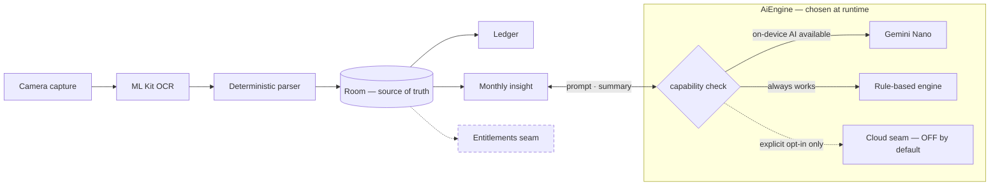

# Hapsum

Point your camera at a receipt. Hapsum reads it, sorts it, and explains your month — all
on-device. An AI receipt scanner and expense tracker in Kotlin, Jetpack Compose and MVI.

## The five-year-old version

> You take a picture of a receipt. The phone reads it all by itself — it doesn't send your money
> stuff to anyone — and it keeps a tidy list of what you bought. At the end of the month it tells
> you the story of your spending.

## Why I'm building this

Receipts are where personal finance actually leaks: the card statement says "MART-4711, $87.40"
and the details of what happened live on a strip of thermal paper in the recycling. On-device AI
has just become good enough to read that paper and understand it without sending a single byte
anywhere, and I want the app that does so to exist. I've spent years building mobile apps where
reliability mattered; Hapsum works the same principles — predictable state, testable logic,
privacy by default — in the Android ecosystem. The repo is deliberately built in public, one
reviewed commit at a time, as a working demonstration of disciplined AI-assisted engineering.
The name is Korean 합 (*hap*, "to sum") +
English "sum" — both halves mean the same thing.

## Bird's-eye view

This is the target shape — today the repo holds the Compose shell and the build harness, and
the progress board below is the ground truth. Everything will flow one way into Room and out to
the two reading surfaces; the AI engine is a runtime decision with a deterministic floor. The
`Entitlements` box is drawn dashed because it is designed, not built — a pure-domain boundary
where a paid tier could plug in later without refactoring.

## Progress

One atomic commit per step — watch the history, that's the product.

- ✅ 1. License and hygiene files
- ✅ 2. Gradle wrapper and version catalog
- ✅ 3. App module with Compose shell
- ✅ 4. AI harness: CLAUDE.md, slash commands, progress board
- ✅ 5. CI running the same gate as local builds
- ✅ 6. README v1
- ✅ 7. `:core:model` + `:core:testing` carve-out
- ✅ 8. `:core:data` — Room schema + offline-first repository
- ✅ 9. Room schema exercised against an in-memory database (Robolectric)
- ✅ 10. `:core:designsystem` tokens/theme
- ✅ 11. Push-as-approval cadence recorded in the AI harness
- ✅ 12. `:core:mvi` runtime + reducer test harness
- ✅ 13. `:feature:ledger` list screen — first Compose UI test, Nav3 graph in `:app`
- ✅ 14. Receipt persistence + schema v2 — the first Room migration, `MigrationTestHelper`-proven
- ✅ 15. Hilt DI — `AppContainer`/`HapsumDataContainer` retired, `LedgerViewModel` `@HiltViewModel`
- ✅ 16. `:feature:capture` — CameraX preview + permission flow, `ReceiptRepository`, first
  effect-emitting screen
- ✅ 17. ML Kit OCR behind a seam + deterministic parser, golden-tested on synthetic fixtures —
  schema v3 (parsed fields + line items)
- ✅ 18. `:core:ai` — deterministic rule-based categorizer, sharing one default-category
  vocabulary with the startup seed
- ✅ 19. `:feature:confirm` — confirm/edit screen writing the `Expense`, schema v4 adds the
  `expenses.lineItemId` FK
- ✅ 20. End-to-end integration test: capture→confirm→ledger against a real in-memory database
- 🔜 21–27. Shared money formatter → Gemini Nano → insights → entitlements seam → coverage gate
  → `v0.1.0` (full ladder in [docs/PROGRESS.md](docs/PROGRESS.md))

## Tech stack and how it's tested

Today the repo holds the shell, the harness, and one unit test; the rest of this table is the
committed, version-pinned plan — each row turns real on its ladder step.

| Area | Choice |
|---|---|
| Language | Kotlin — coroutines and Flow throughout, no Java sources |
| UI | Jetpack Compose, Material 3, single activity, Navigation 3 |
| Architecture | MVVM shell with a strict MVI contract inside — sealed state/intent/effect, pure reducers |
| DI | Hilt (KSP) |
| Data | Room as source of truth, DataStore for prefs — offline-first, no network in MVP |
| Camera / OCR | CameraX, ML Kit Text Recognition v2 |
| On-device AI | Gemini Nano via the ML Kit GenAI APIs, with a deterministic rule-based fallback |
| Unit testing | JUnit4, MockK, Turbine, kotlinx-coroutines-test |
| UI testing | Compose UI tests, one deliberate Espresso interop test |
| Quality | ktlint via Spotless, Android Lint, Kover, GitHub Actions |

Testing philosophy: reducers are pure functions, so state logic tests need no Android and no
mocks; dispatchers are injected, so tests control time instead of sleeping through it; Flows are
asserted with Turbine; UI behavior gets Compose tests, and classic-stack interop gets exactly one
Espresso proof. Versions live in [`gradle/libs.versions.toml`](gradle/libs.versions.toml) — the
single source of truth.

> [!NOTE]
> Kotlin is pinned at 2.3.21, one minor line behind latest, on purpose: Room 3 is KSP-only and
> KSP has a confirmed-open codegen failure on Kotlin 2.4 (google/ksp#2964). The pin moves when
> the issue closes. Separately, compileSdk stays at 36 while API 37 is in beta, so
> core/activity/lifecycle ride one stable behind their newest releases, which require
> compileSdk 37.

## How this repo is built with AI

Four disciplines, each a real file you can read:

- **Context** — [`CLAUDE.md`](CLAUDE.md): project law the assistant loads every session
- **Prompts** — [`.claude/commands/`](.claude/commands): the loop as versioned slash commands
- **Harness** — [`scripts/verify.sh`](scripts/verify.sh): one gate; the pre-commit hook and
  [CI](.github/workflows/ci.yml) run the identical script
- **Loop** — `/next-commit` cadence with [`docs/PROGRESS.md`](docs/PROGRESS.md) as its state,
  and a human approval gate at every phase boundary

AI writes the first drafts. Tests, review boundaries, and the commit history decide what stays.
The architecture's job is to make incorrect AI output cheap to detect and cheap to remove.
Commits carry no per-commit AI trailers — this section and the committed harness are the
disclosure.

## Privacy stance

Nothing leaves the device in the MVP — there is no network layer to leak through. Cloud AI
exists only as an explicit, off-by-default opt-in seam. Test fixtures are synthetic; no real
receipt ever enters this repository.

## Roadmap and sustainability

Phase 1 builds the ledger on Room; then CameraX capture, the OCR-to-parser pipeline against
synthetic fixtures, the AI engine ladder, monthly insights, and a `v0.1.0` release with
screenshots and an installable APK. The core app stays open source; a paid Pro build may later
add conveniences (unlimited scans, CSV/PDF export, deeper insights) through the `Entitlements`
boundary drawn dashed above. Designed diagrams and real screenshots replace the Mermaid sketch
when there is something real to photograph.

---

Apache-2.0 · built by [@sebkoo](https://github.com/sebkoo) · If the architecture notes or the
AI harness are useful to you, a star helps other mobile engineers find them.
